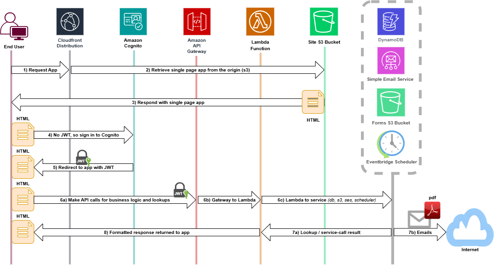

# ETT (Ethical Transparency Tool)

This repository comprises a cloud-based implementation of the [Ethical Transparency Tool for The Societies Consortium on Sexual Harassment in STEMM](https://societiesconsortium.com/ett/) as described in the [Overview Briefing Packet](https://societiesconsortium.com/wp-content/uploads/2022/12/Ethical-Transparency-Tool-Briefing-Packet-Without-Forms.pdf). This implementation is designed for hosting on [AWS](https://aws.amazon.com/) and built completely around [AWS serverless technologies](https://aws.amazon.com/serverless/).

### Topology

This diagram depicts the basic arrangement of services and the sequencing a request made by a single page app client makes in order to access backend services (database, emailing, events, etc.)



### Setup - Prerequisites

- [AWS CDK](https://docs.aws.amazon.com/cdk/v2/guide/home.html)
- [AWS CLI](https://aws.amazon.com/cli/)
- [Node & NPM](https://nodejs.org/en/download)
- [Git](https://git-scm.com/book/en/v2/Getting-Started-Installing-Git)
- [Visual Studio Code](https://code.visualstudio.com/download)
- Admin role for target account *(ie: Shibboleth-InfraMgt/yourself@bu.edu, for the BU CSS account)*

### Setup - Steps

Build the entire application and AWS infrastructure from scratch.

1. **Clone this repository**

2. **Modify the `./context/context.json` file**.
   You will probably only adjust 2 or 3 of the attributes in this file - a breakdown of all attributes are [**here**](./docs/Context.md)

3. **Obtain [security credentials](https://docs.aws.amazon.com/IAM/latest/UserGuide/security-creds.html?icmpid=docs_homepage_genref)** for the admin-level [IAM role](https://docs.aws.amazon.com/IAM/latest/UserGuide/id_roles.html) you will be using for accessing the aws account to lookup and/or deploy resources.
   Create a [named profile](https://docs.aws.amazon.com/cli/latest/userguide/cli-configure-files.html#cli-configure-files-using-profiles) out of these credentials in your [`~/.aws/credentials`](https://docs.aws.amazon.com/cli/latest/userguide/cli-configure-files.html#cli-configure-files-where) file.

4. Install all dependencies:

   ```
   for line in $(find . -maxdepth 4 -name package.json -print | grep -v '/node_modules/') ; do (cd $(dirname $line) && npm install); done \;
   ```

5. ***Bootstrapping*** is the process of provisioning resources for the AWS CDK before you can deploy AWS CDK apps into an AWS [environment](https://docs.aws.amazon.com/cdk/v2/guide/environments.html). *(An AWS environment is a combination of an AWS account and Region).* You only need to bootstrap once for your chosen region within your account. The presence of a `"CDKToolKit"` cloud-formation stack for that region will indicate bootstrapping has already occurred. To bootstrap, follow [these steps](https://docs.aws.amazon.com/cdk/v2/guide/bootstrapping.html#bootstrapping-howto). The simple bootstrapping command is:

   ```
   export AWS_PROFILE=my_named_profile
   cdk bootstrap aws://[aws account ID]/us-east-1
   ```

6. **[OPTIONAL] Run the [CDK synth command](https://docs.aws.amazon.com/cdk/v2/guide/cli.html#cli-synth) command** to generate the cloudformation template that will be used to create the stack:

   ```
   mkdir ./cdk.out 2> /dev/null
   cdk synth &> cdk.out/ett.template.yaml
   ```

   *NOTE: The synth command will create a .json file, but will also output yaml to stdout. The command above redirects that output to a yaml file alongside the json file.*

7. **[OPTIONAL] Debug synthesis with breakpoints**
   If developing in vscode, add the following debug configuration to the `${workspaceFolder}/.vscode/launch.json` file if it does not already exist:

   ```
   {
     "version": "0.2.0",
     "configurations": [
       {
         "type": "node",
         "request": "launch",
         "name": "CDK Debugger (App)",
         "skipFiles": ["<node_internals>/**"],
         "runtimeArgs": ["-r", "./ett-auth/node_modules/ts-node/register/transpile-only"],
         "args": ["${workspaceFolder}/ett-auth/bin/ett.ts"]
       }
     ]
   }
   ```

   Place a breakpoint at the desired location and run the launch configuration.

8. **Enable API Gateway Logging** for the account. Follow [these directions](./docs/EnableApiGatewayLogging.md)

9. **Request a public certificate in ACM**

   1. It is assumed that you have acquired a domain with a domain registrar (like godaddy), that supports wildcarding *`(IE: "*.myettdomain.com")`*.
      Create a corresponding certificate in ACM following [these directions](https://docs.aws.amazon.com/acm/latest/userguide/acm-public-certificates.html).
   2. Before cloudforming the stack, domain and certificate need to be configured so that the CloudFront distribution is created with an alternate domain that reflects the certificate.
      Make sure the following entries are made in the `contexts/context.json` file:
      - "ETT_DOMAIN": "<subdomain>.<certificate domain", *(IE: "dev.myettdomain.com")*
         *NOTE: You can also simply use the root domain (no subdomain)*
      - "ETT_DOMAIN_CERTIFICATE_ARN": the ARN of the certificate
         *(IE: "`arn:aws:acm:us-east-1:037860335094:certificate/47aadc38-fe33-4519-932a-10c6ababaccc`")*
   
10. **Run the CDK deploy command to create the stack**
    This CDK deploy command is documented [here](https://docs.aws.amazon.com/cdk/v2/guide/cli.html#cli-deploy)

    ```
    npm run deploy
    
    # or to completely tear down and replace a stack without prompts use:
    
    npm run redeploy
    ```

11. **Populate static website content**
    At this point, the infrastructure for the backend have been created. The next step would be to load all images, stylesheets, html files, etc. up to the S3 bucket that has been created for them:

    ```
    npm run load-bucket
    ```

    These uploadable items are all part of the git repository.
    However, any front end developed separately *(ie: a react app)* should have it's main build artifacts uploaded to the same s3 bucket separately. The S3 bucket can be identified with the following name: `${STACK_ID}-${LANDSCAPE}-static-site-content`, where STACK_ID and LANDSCAPE reflect what is set in the `./context/context.json` file.

12. **Configure the ETT domain**
    At this point, the website public landing page should be reachable from the browser.
    You can reach it on the default domain of the [CloudFront distribution](https://docs.aws.amazon.com/AmazonCloudFront/latest/DeveloperGuide/distribution-working-with.html) that manages content delivery for the website.
    This url is listed as the value of the `CloudFrontURL` key of the stack output *`(IE: "https://d227na12o3l3dd.cloudfront.net")`*.
    However, to reach the default URL at the domain you have prepared, you must perform a few manual steps:

    1. **Create a [Hosted Zone](https://docs.aws.amazon.com/Route53/latest/DeveloperGuide/route-53-concepts.html#route-53-concepts-hosted-zone)**
       You can create a hosted zone through the management console or using the following:

       ```
       aws route53 create-hosted-zone \
         --name myettdomain.com \
         --caller-reference $(date +%Y%m%d%H%M%S) \
         --hosted-zone-config Comment="Hosted zone for myettdomain.com"
       ```

    2. **Add the [ACM CNAME](https://docs.aws.amazon.com/acm/latest/userguide/dns-validation.html#cnames-overview) as a record to the Hosted Zone**
       You should see a "Create records in Route 53" button on the management console for the ACM Certificate. Click this to add the CNAME to the hosted zone you created.

    3. **Add one or more A records**
       The following example creates an A record for the "dev.myettdomain.com" subdomain that was reflected in the directions above for creating the public certificate. Adjust the example accordingly if you just want to specify the root domain.

       ```
       HOSTED_ZONE_ID=$(aws route53 list-hosted-zones \
         --query "HostedZones[?Name=='myettdomain.com.'].Id" \
         --output text | sed 's|/hostedzone/||')
         
       CLOUDFRONT_DOMAIN=$(aws cloudfront list-distributions \
         --query "DistributionList.Items[?Aliases.Items && contains(Aliases.Items, 'dev.myettdomain.com')].DomainName" \
         --output text)
         
       aws route53 change-resource-record-sets \
         --hosted-zone-id $HOSTED_ZONE_ID \
         --change-batch '{
             "Changes": [{
                 "Action": "CREATE",
                 "ResourceRecordSet": {
                     "Name": "dev.myettdomain.com",
                     "Type": "A",
                     "AliasTarget": {
                         "DNSName": "${CLOUDFRONT_DOMAIN}",
                         "EvaluateTargetHealth": false,
                         "HostedZoneId": "Z2FDTNDATAQYW2"
                     }
                 }
             }]
         }'
       ```

    4. **Change the NS records at you domain registrar.**
       As the domain owner, you need to make modifications to your domain with your domain provider (ie: godaddy), so that the NS servers listed are replaced with the 4 NS servers of the hosted zone. You can find those entries in the management console for the hosted zone.

     

13. **Set up Identities in SES**
    Before you can send emails with the ETT app, the recipients need to have been set up in the AWS simple email service as one of the following:
    
    - An [email identity](https://docs.aws.amazon.com/ses/latest/dg/creating-identities.html#verify-email-addresses-procedure)
    - A [domain identity](https://docs.aws.amazon.com/ses/latest/dg/creating-identities.html#verify-domain-procedure)

    In either case, the recipients *(either a single address, or a domain owner)* have been involved in the setup process by granting consent via email to receive further emails from SES.
    Initially, for testing, you would set up an identity for each email address you intend to receive emails using the ETT app.
    Later, you will want to [request production access](https://docs.aws.amazon.com/ses/latest/dg/request-production-access.html)
    
14. **Invite the initial system administrator**
    At this point, the website public landing page should be reachable from the browser on the ETT domain.
    However, there are no users in the database. Normally users who are either a system administrator or an a member of an entity who uses the app are invited by other users. But in this case, there is nobody to log in and perform such an action, so it must be done from your terminal via an api call. In vscode:

    ```
    npm run invite-sysadmin ett-sysadmin@gmail.com
    ```

    Replace "ett-sysadmin@gmail.com" with the actual email address.

15. **[OPTIONAL] Backend utilities and tweaks**
    The system administrator will primarily be used to invite other system administrators and administrative support persons.
    However, there are other actions a system administrator can do that mostly apply in a testing or repair context.
    These functions may not be available in whatever separately developed front-end is used for the website, but there is a hidden dashboard that is deployed as part of the backend that is written in bootstrap that does contain the full system administrator menu of tasks.
    `https://[ett-domain]/bootstrap/index.htm`
    Select "System Administrator" from the radio selection and log in.

    - **Invitation**
       You can invite via email another system administrator, an administrative support person, or an authorized individual
    - **Configuration**
       The app derives some of its configuration from a database table where mostly duration-specific configurations are kept.
       These mostly apply to how much time applies after a certain event before an event bridge schedule triggers some action.
       This tab was used heavily during testing to reduce these durations from months to minutes.
    - **Database**
       A simple database viewer. Provides an alternative way of viewing database content from the dynamodb management console.
    - **Shortcuts**
       Contains functions to:
       - **Build an entity** that is fully staffed and ready to go.
          This bypasses the entity registration steps and the invitation emails that go with it.
       - **Tear down an entity**
          Provides a quick way to remove an entity including
          - All users purged from database: Administrative support person and both Authorized individuals
          - The Cognito accounts of each purged user
          - All content from S3 related to activity specific to the entity (exhibit forms)
       - **Delete a Consenter**
          Provides a quick way to remove a consenter. Includes
          - The consenters database record
          - The consenters Cognito account
          - All S3 content stored in S3 related to the consenter
    - **Clean sheet of paper**
       This is a "nuclear option" for developers/testers to bring the state of the app back to "factory settings".
       *NOTE: Probably a good idea not to go near this tab in any production deployment*
    
16. **Teardown the stack**
    In the event that you want to remove the entire ett stack, you will run into trouble doing attempting a stack deletion directly from the AWS management console. This is because cloudformation will not be able to delete the [lambda@edge](functions) functions associated with the cloudfront distribution because these are replicated to other regions. The lambda functions need to be disassociated from the distribution first, which lead to an automatic  purge of the replicated resources over time. Both cloudfront and cloudformation need to see that these edge functions are free and clear of their replicated content before being able to start deleting the remaining cloudfront resources.
    Therefore, delete the stack like this:

    ```
    npm run teardown
    ```

    This runs some scripting with the SDK that will disassociate the lambda functions from cloudfront, and engages a polling cycle that repeats lookups for both cloudfront and cloudformation until the replicated resources no longer show up in the lookup results.
    Once the polling comes to that point, the main stack deletion command is executed.
